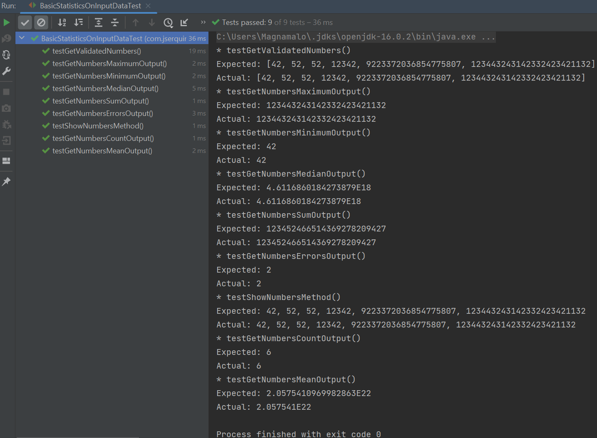

# basic-statistics-on-input-data
take-home kata done in java.

---

### context

take-home coding test solved in under 6 hours, whereas the tester gave 72 hours total.

### post-mortem

despite the timely solve, I was not asked to go forward with the role. looking back, the tester might have wanted more separation of concerns and classing, which I foregone for speed's sake. despite such, this solution produces perfect results down to the decimal point.

### bug

found a bug where junit-jupiter > 5.7.0 would error out during test running. did a hard limit for the package version in pom.xml to keep us from using the bugged version.

### screenshot
